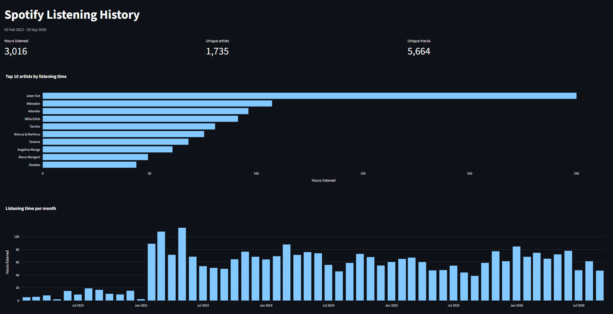

# Statspotify

An interactive dashboard that turns my Spotify Extended Streaming History into charts, built with Python, pandas, Plotly and Streamlit.



## Features

- Cleans ~99k raw streaming records: drops podcasts and unknown items, removes plays shorter than 30 seconds, converts UTC timestamps to local time
- Summary metrics: total hours listened, unique artists, unique tracks
- Top 10 artists by listening time
- Monthly listening hours across 4+ years of history

## Tech stack

- Python 3.11+
- pandas for loading, cleaning and grouping the data
- Plotly Express for interactive charts
- Streamlit for the web interface

## Run it locally

1. Request your own data from Spotify: **Account > Privacy > Download your data > Extended streaming history**. It can take up to 30 days to arrive.
2. Create a `data/` folder in the project root and put the `Streaming_History_Audio_*.json` files into it.
3. Install the dependencies and start the app:

```bash
pip install -r requirements.txt
streamlit run app.py
```

The app opens at `http://localhost:8501`.

## Project structure

```
Statspotify/
├── app.py            # Streamlit app
├── src/
│   ├── clean.py      # loading and cleaning the data
│   └── charts.py     # Plotly chart functions
├── notebooks/        # exploration scripts
├── screenshots/      # images used in this README
├── requirements.txt
└── README.md
```

## How the data is cleaned

- Only the columns needed for the analysis are kept (timestamp, track, artist, album, track URI, milliseconds played)
- Rows without a track or artist name (podcast episodes and unknown items) are dropped
- Plays shorter than 30 seconds are removed, matching the threshold Spotify uses to count a stream
- Timestamps are converted from UTC to the `Europe/Istanbul` time zone
- Duplicate plays are removed

## Data privacy

Raw streaming history contains personal details such as IP addresses, so it is never committed to this repository (`data/` is listed in `.gitignore`). Only code and screenshots are published.
