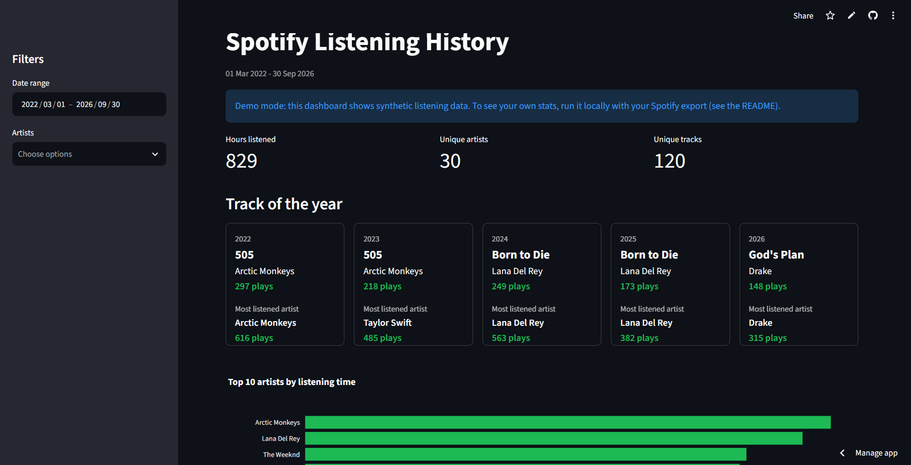
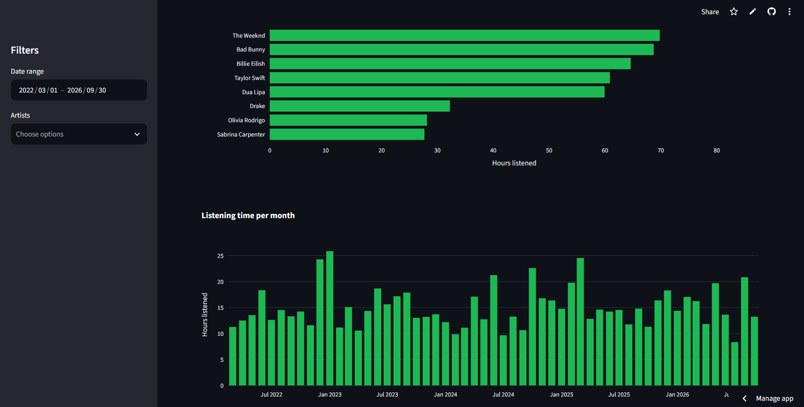
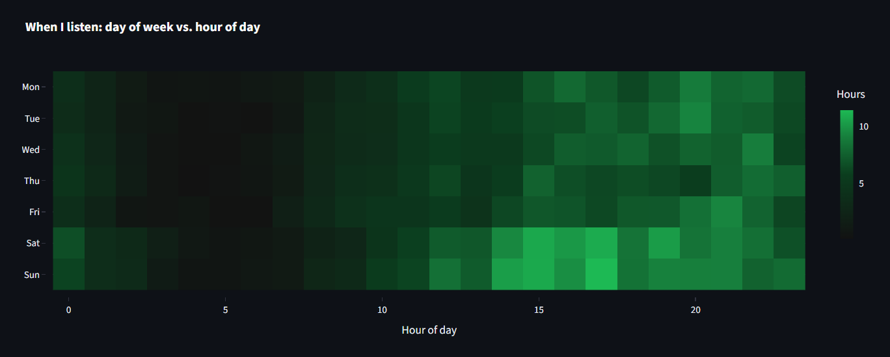
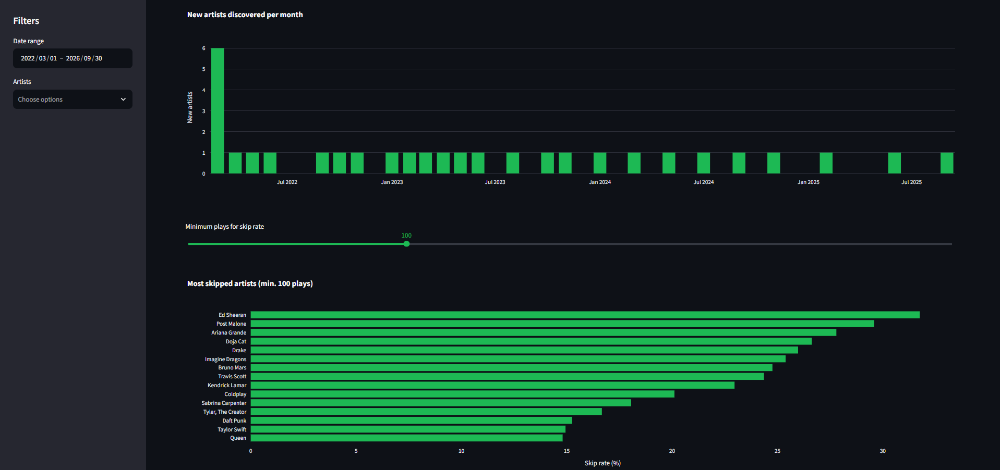
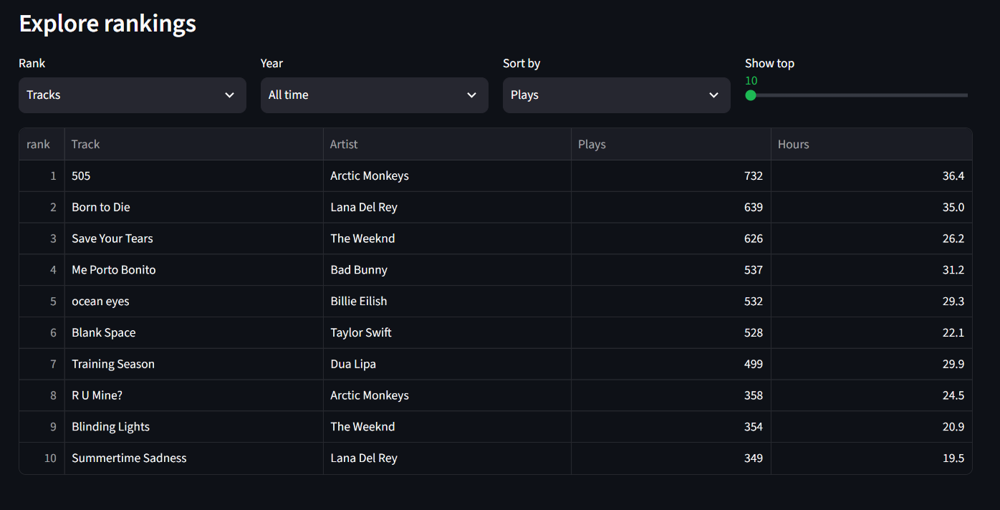

# Statspotify

An interactive dashboard that turns Spotify Extended Streaming History into charts and rankings. Built with Python, pandas, Plotly and Streamlit and developed on my own history (~99k raw records over 4+ years).

**[Live demo](https://statspotify-uzakekhvywuspaajspnucs.streamlit.app/)** (runs on synthetic data, see [Demo data](#demo-data))



## Features

- **Filters:** date range and artist selection, applied to the whole dashboard
- **Summary metrics:** hours listened, unique artists, unique tracks
- **Track of the year:** for each year, the most played track and the most played artist with play counts
- **Top 10 artists** by listening time
- **Monthly listening hours** over the whole history

  

- **Listening heatmap:** hours listened by day of week and hour of day

  

- **New artists per month:** how many artists were heard for the first time each month, with the 3 most played discoveries shown on hover
- **Skip rate:** artists whose tracks are skipped most often (adjustable minimum number of plays)

  

- **Rankings explorer:** top tracks, artists or albums for any year or all time, sortable by plays or hours

  

## Demo data

The live demo does not use my real listening history. It runs on a **synthetic dataset**: 30 well-known artists, about 17,800 randomly generated plays between March 2022 and September 2026, in the same format as Spotify's export. Only the artist and track names are real, all play counts and timestamps are random.

The app loads the data like this:

1. If there is a personal export in `data/`, it uses that
2. Otherwise it falls back to `sample_data/` and shows a "Demo mode" notice

To regenerate the demo data (the output is deterministic):

```bash
python scripts/make_sample_data.py
```

Note: the demo is hosted on Streamlit Community Cloud's free tier, so it goes to sleep when unused. If you see a "wake up" button, click it and give it a moment.

## Tech stack

- Python 3.11+
- pandas for loading, cleaning and aggregating the data
- Plotly Express for interactive charts
- Streamlit for the web interface and Streamlit Community Cloud for hosting
- pytest for tests

## Run it locally with your own data

1. Request your own data from Spotify: **Account > Privacy > Download your data > Extended streaming history**. It can take up to 30 days to arrive.
2. Create a `data/` folder in the project root and put the `Streaming_History_Audio_*.json` files into it.
3. Install the dependencies and start the app:

```bash
pip install -r requirements.txt
streamlit run app.py
```

The app opens at `http://localhost:8501`. Without a `data/` folder it starts with the demo data.

To run the tests:

```bash
pip install pytest
python -m pytest
```

## Project structure

```
Statspotify/
├── app.py            # Streamlit app
├── src/
│   ├── clean.py      # loading and cleaning the data
│   ├── charts.py     # Plotly chart functions
│   └── stats.py      # yearly favorites and rankings
├── scripts/
│   └── make_sample_data.py   # generates the synthetic demo data
├── sample_data/      # synthetic demo data (safe to publish)
├── tests/            # pytest tests for cleaning and stats
├── notebooks/        # exploration scripts
├── .streamlit/       # Streamlit theme config
├── screenshots/      # images used in this README
├── requirements.txt
└── README.md
```

## How the data is cleaned

- Only the columns needed for the analysis are kept (timestamp, track, artist, album, track URI, milliseconds played)
- Rows without a track or artist name (podcast episodes and unknown items) are dropped
- Plays shorter than 30 seconds are removed, matching the threshold Spotify uses to count a stream
- Timestamps are converted from UTC to local time (`Europe/Istanbul` by default, configurable through the `tz` argument of `clean_history`)
- Duplicate plays are removed

For the skip rate chart, short plays are kept and flagged instead of dropped, since they are exactly what the chart measures. A "skip" here means a play shorter than 30 seconds. I did not use Spotify's own `skipped` column because it is unreliable in the exported data.

## Notes on the data

- The first and last years of a history are usually partial years, so their totals are lower
- The first month of the history inflates the "new artists" chart, because every artist heard that month counts as new
- Artist rankings by hours and by plays can differ: artists with short songs rank higher by plays than by time

## Data privacy

Raw streaming history contains personal details such as IP addresses, so it is never committed to this repository (`data/` is listed in `.gitignore`). Only code, synthetic demo data and screenshots of the demo are published.